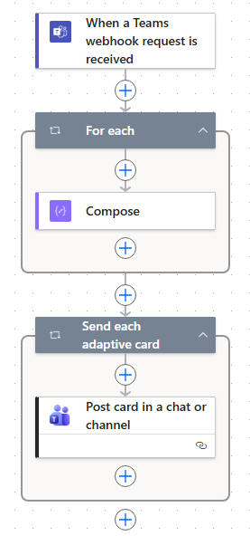
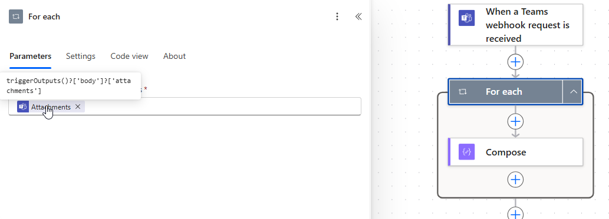
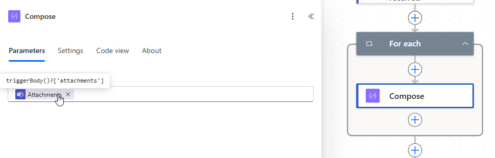
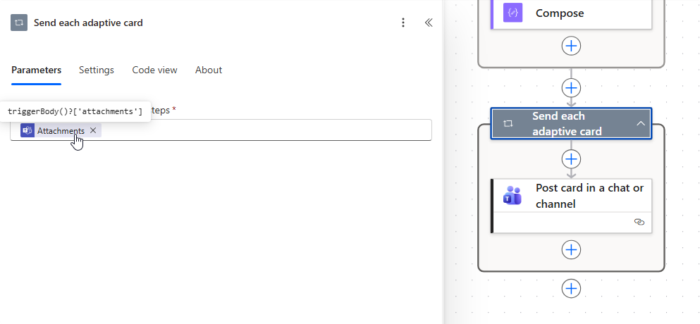
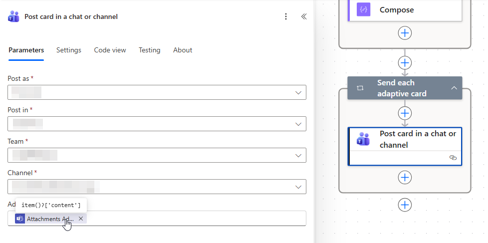
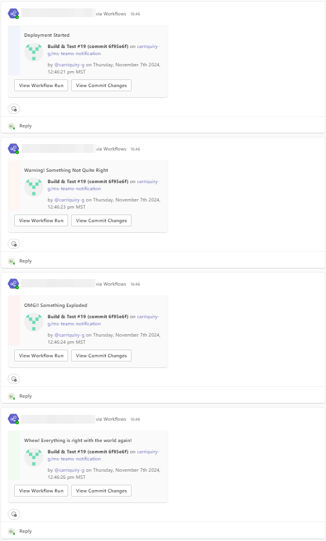
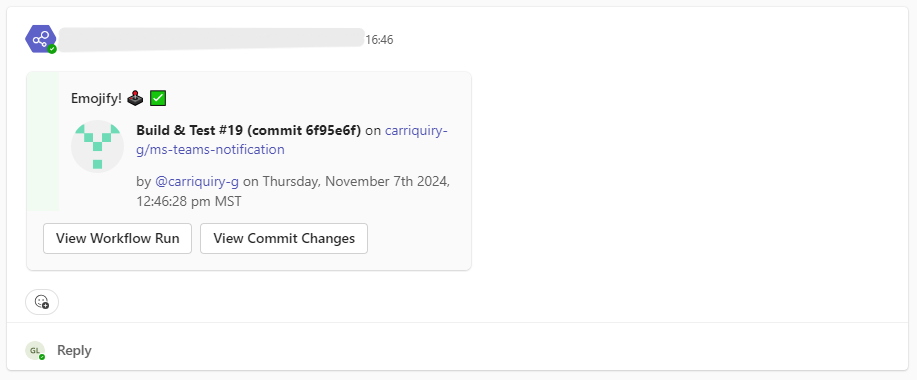

<p align="center">
  <a href="https://github.com/carriquiry-g/ms-teams-notification/actions"></a>
</p>

# Microsoft Teams Notification
A GitHub Action that sends customizable notifications to a dedicated Microsoft Teams channel.

## Usage
1. Add `MS_TEAMS_WEBHOOK_URI` on your repository's configs on Settings > Secrets. It is the [Webhook URI](https://support.microsoft.com/en-us/office/create-incoming-webhooks-with-workflows-for-microsoft-teams-8ae491c7-0394-4861-ba59-055e33f75498) of the dedicated Microsoft Teams channel for notification.

2) Add a new `step` on your workflow code below `actions/checkout@v4`:

```yaml
name: MS Teams Notification

on: [push, pull_request]

jobs:
  build:
    runs-on: ubuntu-latest

    steps:
      - uses: actions/checkout@v4
      # this is the new step using the ms-teams-notification action
      - name: Notify dedicated teams channel
        uses: carriquiry-g/ms-teams-notification@v2
        with:
          github-token: ${{ github.token }} # this will use the runner's token.
          ms-teams-webhook-uri: ${{ secrets.MS_TEAMS_WEBHOOK_URI }}
          notification-summary: Your custom notification message
          notification-style: good
          timezone: America/Denver
          verbose-logging: true
```

3. Make it your own with the following configurations.
   - `github-token` - (required), set to the following:
     - `${{ github.token }}`
   - `ms-teams-webhook-uri` - (required), setup a new secret to store your Microsoft Teams Webhook URI (ex. `MS_TEAMS_WEBHOOK_URI`). Learn more about setting up [GitHub Secrets](https://help.github.com/en/actions/configuring-and-managing-workflows/creating-and-storing-encrypted-secrets) or [Microsoft Teams Incoming Webhook](https://support.microsoft.com/en-us/office/create-incoming-webhooks-with-workflows-for-microsoft-teams-8ae491c7-0394-4861-ba59-055e33f75498).
   - `notification-summary` (required), Your custom notification message (ex. Deployment Started or Build Successful)
   - `notification-style` (optional), color to help distinguish type of notification. Can be `default`, `emphasis`, `accent`, `good`, `warning`, or `attention`, per [`ColumnSet` style property options](https://adaptivecards.io/explorer/ColumnSet.html).
   - `custom-adaptive-card` (optional), Full custom Adaptive Card JSON. If provided, this overrides the default card template. The JSON must be a valid Adaptive Card with `type: "AdaptiveCard"`. You can design your own card in [Adaptive Cards Designer](https://adaptivecards.microsoft.com/designer).
   - `timezone` - (optional, defaults to `UTC`), a [valid database timezone name](https://en.wikipedia.org/wiki/List_of_tz_database_time_zones), (ex. Australia/Sydney or America/Denver, etc.)
   - `verbose-logging` - (optional, defaults to `false`), Emits additional logging showing the sent message card and response from the webhook.

## How to setup the workflow
After creating the channel webhook in Microsoft Teams, you should see in your Workflows tab or in Power Automate that a job was created for this purpose. You can copy the following example to make sure it works as expected.

### Workflow overview
This is what the whole workflow looks like.

<p align="center">

</p>

### Key configurations
#### For each
Make sure when hovering over `Attachments`, it shows `triggerOutputs()?['body']?['attachments']` as shown below.

<p align="center">

</p>

#### Compose
Make sure when hovering over `Attachments`, it shows `triggerOutputs()?['attachments']` as shown below.

<p align="center">

</p>

#### Send each adaptive card
Make sure when hovering over `Attachments`, it shows `triggerOutputs()?['attachments']` as shown below.

<p align="center">

</p>

#### Post card in a chat or channel
For this step, configure the `Post as`, `Post in`, `Team`, and `Channel` fields as needed. Some may not appear depending on your selection. The important part is the `Adaptive Card` field. Complete it to use `Attachments Adaptive Card` and make sure that when hovering over it, it shows `item()?['content']` as shown below.

<p align="center">

</p>

> [!NOTE]
> This is what worked for me and my team using Microsoft Teams and Power Automate since the `v2.1.0` release. If you find a better/different way to do this, please open an issue or a PR to help improve this action and its documentation.

## Examples
As you can see below, the `notification-summary` and `notification-style` are being used to customize the appearance of the message.

<p align="center">

</p>

### Using Custom Adaptive Cards
You can provide a fully custom Adaptive Card JSON using the `custom-adaptive-card` input. This allows you to create highly customized notifications:

```yaml
- name: Notify with custom card
  uses: carriquiry-g/ms-teams-notification@v2
  with:
    github-token: ${{ github.token }}
    ms-teams-webhook-uri: ${{ secrets.MS_TEAMS_WEBHOOK_URI }}
    custom-adaptive-card: |
      {
        "type": "AdaptiveCard",
        "body": [
          {
            "type": "TextBlock",
            "size": "Medium",
            "weight": "Bolder",
            "text": "✅ Deployment completed for **${{ env.ENVIRONMENT }}** environment!"
          },
          {
            "type": "TextBlock",
            "text": "📦 Image: **${{ env.IMAGE_NAME }}:${{ github.sha }}**"
          },
          {
            "type": "TextBlock",
            "text": "🌐 Deployed App URL: https://${{ needs.deploy.outputs.url }}"
          }
        ],
        "actions": [
          {
            "type": "Action.OpenUrl",
            "title": "View Deployment",
            "url": "https://${{ needs.build_and_deploy.outputs.webapp-url }}"
          }
        ],
        "version": "1.2"
      }
```

**Note:** When using `custom-adaptive-card`, the `notification-summary` and `notification-style` inputs are ignored.

### Emojis
Emojis are supported in Microsoft Teams Adaptive Cards. However, if any emoji isn't rendered correctly, you can hack your way through it using HEX codes. For example, in `notification-summary` I used `Emojify! 🕹️ &#x2705;` for the following screenshot adn both were rendered correctly. HEX codes for emojis [here](https://apps.timwhitlock.info/emoji/tables/unicode).

<p align="center">

</p>
