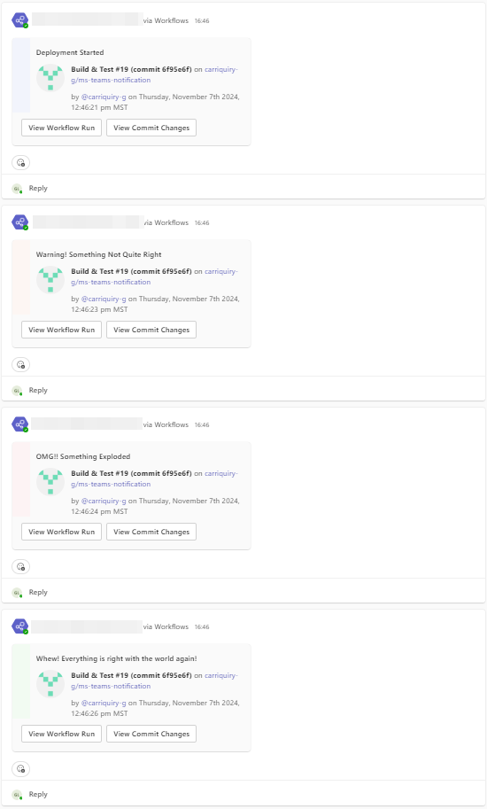
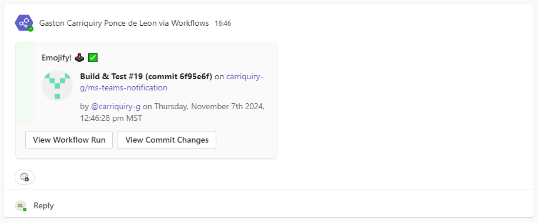

<p align="center">
  <a href="https://github.com/carriquiry-g/ms-teams-notification/actions"></a>
</p>

# Microsoft Teams Notification
A GitHub Action that sends customizable notifications to a dedicated Microsoft Teams channel.

## Usage
1. Add `MS_TEAMS_WEBHOOK_URI` on your repository's configs on Settings > Secrets. It is the [Webhook URI](https://support.microsoft.com/en-us/office/create-incoming-webhooks-with-workflows-for-microsoft-teams-8ae491c7-0394-4861-ba59-055e33f75498) of the dedicated Microsoft Teams channel for notification.

2) Add a new `step` on your workflow code below `actions/checkout@v4`:

```yaml
name: MS Teams Notification

on: [push, pull_request]

jobs:
  build:
    runs-on: ubuntu-latest

    steps:
      - uses: actions/checkout@v4
      # this is the new step using the ms-teams-notification action
      - name: Notify dedicated teams channel
        uses: carriquiry-g/ms-teams-notification@v2
        with:
          github-token: ${{ github.token }} # this will use the runner's token.
          ms-teams-webhook-uri: ${{ secrets.MS_TEAMS_WEBHOOK_URI }}
          notification-summary: Your custom notification message
          notification-style: good
          timezone: America/Denver
          verbose-logging: true
```

3. Make it your own with the following configurations.
   - `github-token` - (required), set to the following:
     - `${{ github.token }}`
   - `ms-teams-webhook-uri` - (required), setup a new secret to store your Microsoft Teams Webhook URI (ex. `MS_TEAMS_WEBHOOK_URI`). Learn more about setting up [GitHub Secrets](https://help.github.com/en/actions/configuring-and-managing-workflows/creating-and-storing-encrypted-secrets) or [Microsoft Teams Incoming Webhook](https://support.microsoft.com/en-us/office/create-incoming-webhooks-with-workflows-for-microsoft-teams-8ae491c7-0394-4861-ba59-055e33f75498).
   - `notification-summary` (required), Your custom notification message (ex. Deployment Started or Build Successful)
   - `notification-style` (optional), color to help distinguish type of notification. Can be `default`, `emphasis`, `accent`, `good`, `warning`, or `attention`, per [`ColumnSet` style property options](https://adaptivecards.io/explorer/ColumnSet.html).
   - `timezone` - (optional, defaults to `UTC`), a [valid database timezone name](https://en.wikipedia.org/wiki/List_of_tz_database_time_zones), (ex. Australia/Sydney or America/Denver, etc.)
   - `verbose-logging` - (optional, defaults to `false`), Emits additional logging showing the sent message card and response from the webhook.

## Examples
As you can see below, the `notification-summary` and `notification-style` are being used to customize the appearance of the message.

<p align="center">

</p>

### Emojis
Emoji support isn't great for incoming webhooks on Microsoft Teams yet. You can hack your way through it using HEX codes. For example, in `notification-summary` I used `Emojify! &#x1F6A2​​ &#x2705;` for the following screenshot. HEX codes for emojis [here](https://apps.timwhitlock.info/emoji/tables/unicode).

<p align="center">

</p>
